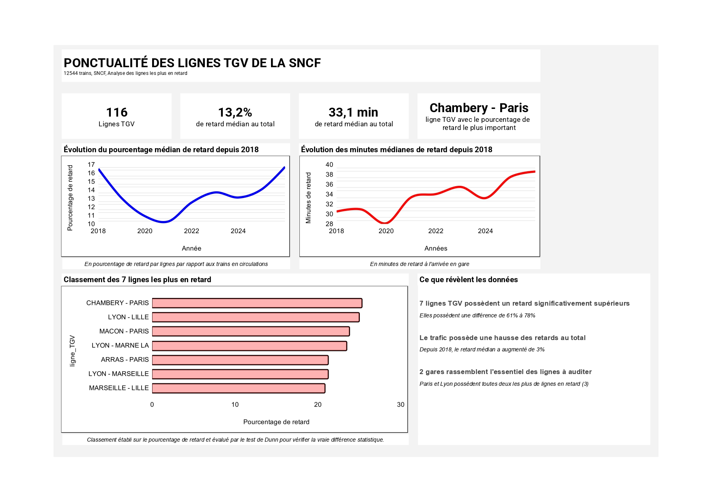

# SNCF-Ponctualite-Analyse

Analyse de la ponctualité des lignes TGV nationales à partir des données publiques de la SNCF, afin d'identifier les lignes les plus en retard et d'évaluer si ces écarts sont statistiquement significatifs.



## Sommaire

- [Résultats clés](#résultats-clés)
- [Contexte](#contexte)
- [Méthodologie](#méthodologie)
- [Stack technique](#stack-technique)
- [Structure du repo](#structure-du-repo)
- [Lancer le projet](#lancer-le-projet)
- [Limites et pistes futures](#limites-et-pistes-futures)
- [Auteur](#auteur)

## Résultats clés

- **116 lignes TGV** analysées, sur **12 544 trains**
- **13,2 %** de retard médian au total
- **33,1 min** de retard médian à l'arrivée
- **Chambery - Paris** : ligne avec le pourcentage de retard le plus important
- **7 lignes TGV** présentent un retard significativement supérieur aux autres (différence de 61 % à 78 %, confirmée par un test de Dunn)
- Depuis 2018, le retard médian a **augmenté de 3 %**
- **Paris et Lyon** concentrent à elles le plus grand nombre de lignes problématiques (3 chacune)

## Contexte

La SNCF analyse régulièrement la ponctualité de ses lignes TGV afin de proposer aux voyageurs l'expérience la plus qualitative possible. Des retards peuvent perturber la satisfaction voyageur, mais aussi les autres trains en circulation, avec un risque de suraccumulation du retard sur le réseau.

Identifier les lignes les plus en retard permet à la société d'agir avec précision pour proposer en priorité des correctifs sur les trajets les plus problématiques.

### Questions traitées

- Au cours de l'année dernière, quel est le classement des lignes TGV nationales les plus en retard (en % et en minutes) ?
- Depuis 2018, quel est ce classement ?
- Depuis 2018, comment le retard sur les lignes TGV nationales a-t-il évolué (en %) ?

### Hypothèses

- **H0** : toutes les lignes TGV sont en retard de manière égale.
- **H1** : certaines lignes TGV sont plus en retard que d'autres.

## Méthodologie

1. **Récupération des données** via l'API publique de la SNCF (`regularite-mensuelle-tgv-aqst`), avec pagination pour contourner la limite de résultats de l'API.
2. **Nettoyage** : suppression des lignes internationales mal encodées, gestion des valeurs manquantes et des valeurs négatives liées à la crise du COVID-19, retrait des lignes à faible effectif non représentatives.
3. **Analyse exploratoire (EDA)** : distribution des variables, détection des valeurs atypiques (boxplot, z-score), matrice de corrélation.
4. **Tests statistiques** : les variables ne suivant pas une distribution normale (skewness/kurtosis), un test de **Kruskal-Wallis** a été utilisé pour comparer les lignes entre elles, complété par un **post-hoc de Dunn** (correction de Bonferroni) pour identifier les paires de lignes significativement différentes.
5. **Classement** des lignes à auditer en priorité, basé sur le pourcentage de retard et validé statistiquement.

## Stack technique

- Python 3
- pandas, numpy
- matplotlib, seaborn
- scipy.stats, scikit-posthocs
- requests (appel API)

## Structure du repo
````
├── main.ipynb # Notebook principal : collecte, nettoyage, EDA, stats, conclusions
├── fx.py # Fonctions utilitaires (calcul des indicateurs, classement, tests statistiques)
├── dashboard.jpg # Dashboard résumant les résultats clés de l'analyse
├── requirements.txt # Ensemble des packages et libraire utiles pour lire l'analyse.
└── README.md
````

## Lancer le projet

```bash
pip install -r requirements.txt
jupyter notebook main.ipynb
```

## Limites et pistes futures

- L'analyse ne croise pas les retards avec l'affluence voyageurs, faute de donnée disponible, un axe pertinent pour la suite.
- D'autres facteurs externes (météo, travaux d'infrastructure, saisonnalité) pourraient expliquer une partie des écarts observés et mériteraient d'être investigués.
- La donnée de retard est publiée par la SNCF elle-même, ce qui introduit un biais potentiel de mesure à garder en tête dans l'interprétation des résultats.
- Les tests non paramétriques et la présence de valeurs atypiques réduisent la puissance statistique de certaines comparaisons.

## Auteur

Alexis LE CALVEZ

